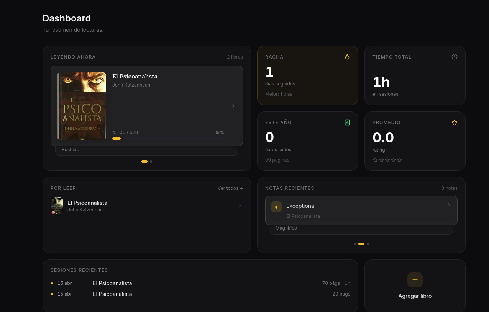
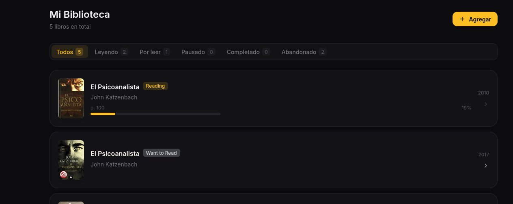
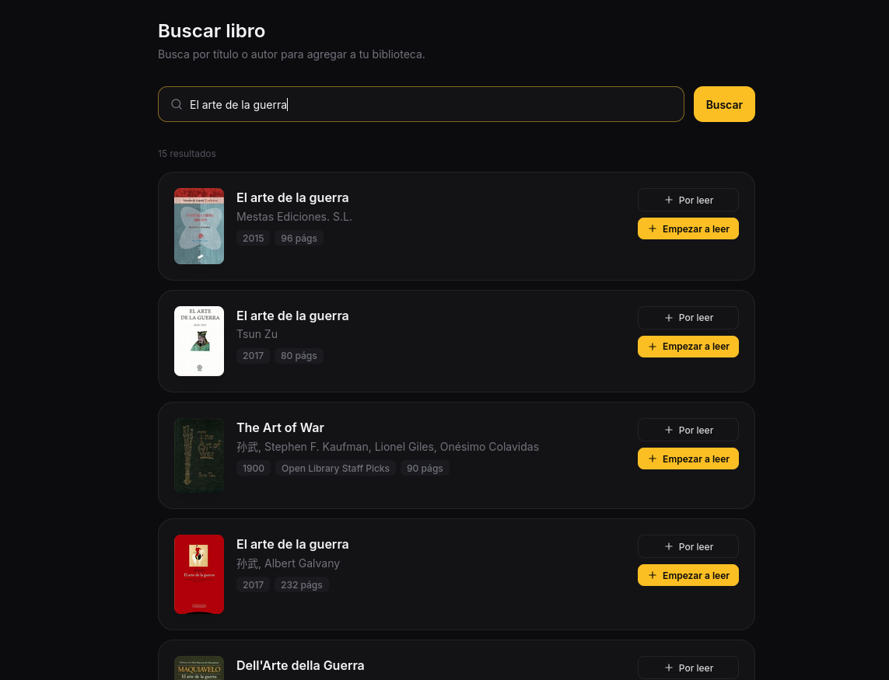
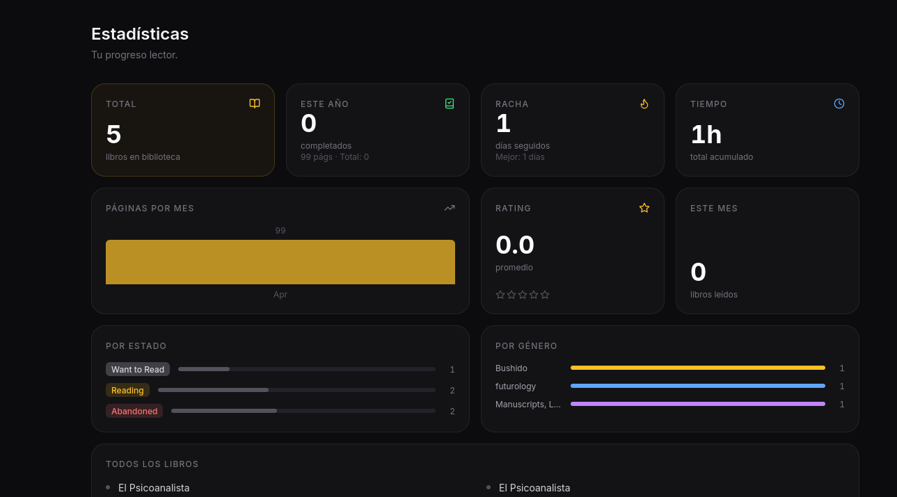

# Books-Tracks

Aplicación web personal para el seguimiento de lecturas, notas y estadísticas.

## ¿Por qué existe?

Quería un lugar propio donde registrar qué estoy leyendo, tomar notas mientras leo y ver métricas que me resultan útiles: racha de días, tiempo acumulado, páginas por mes. Ninguna app existente me convencía del todo, así que construí la mía.

Es un proyecto personal en constante evolución. Simple, directo, resuelve exactamente lo que necesito.

## ¿Qué hace?

- **Biblioteca personal** — registra libros con estados: leyendo, por leer, pausado, completado, abandonado.
- **Seguimiento de progreso** — página actual, sesiones de lectura con páginas y tiempo.
- **Notas y highlights** — citas, reflexiones, marcadores y highlights vinculados a cada libro.
- **Estadísticas** — racha de lectura, tiempo total, páginas por mes, distribución por género y estado.
- **Lector integrado** — pega un enlace (Project Gutenberg, Standard Ebooks, etc.) y lee sin salir de la app.
- **Control de acceso** — sistema de invitación: solo emails autorizados pueden registrarse. Incluye cuenta de demo para que otros exploren.

## Capturas

| Dashboard | Biblioteca |
|-----------|-----------|
|  |  |

| Agregar libro | Estadísticas |
|--------------|-------------|
|  |  |

## Stack

| Capa | Tecnología |
|------|-----------|
| Backend | FastAPI · Python 3.12 · SQLAlchemy 2.0 (async) |
| Base de datos | PostgreSQL (Supabase) |
| Frontend | React 18 · TypeScript · Vite · Tailwind CSS |
| Deploy | Fly.io (app única — FastAPI sirve el frontend compilado) |

## Estructura

```
books-tracks/
├── backend/          # FastAPI app
│   ├── app/
│   │   ├── main.py
│   │   ├── config.py
│   │   ├── database.py
│   │   ├── models/
│   │   ├── routers/
│   │   ├── schemas/
│   │   └── services/
│   └── requirements.txt
├── frontend/         # React app
│   ├── src/
│   │   ├── pages/
│   │   ├── components/
│   │   ├── services/
│   │   ├── context/
│   │   └── hooks/
│   ├── public/
│   └── package.json
├── Dockerfile        # Build multistage: Node → Python
├── fly.toml          # Configuración de Fly.io
└── structure-database.sql
```

## Desarrollo local

### Requisitos

- Python 3.12+
- Node 20+
- PostgreSQL (o acceso a Supabase)

### Backend

```bash
cd backend
python -m venv .venv
source .venv/bin/activate        # Windows: .venv\Scripts\activate
pip install -r requirements.txt

# Crear .env con la URL de la base de datos
echo "DATABASE_URL=postgresql+asyncpg://..." > .env

uvicorn app.main:app --reload
```

API disponible en `http://localhost:8000/api` · Docs en `http://localhost:8000/api/docs`

### Frontend

```bash
cd frontend
npm install
npm run dev
```

App disponible en `http://localhost:5173`

> El frontend usa un proxy Vite hacia `localhost:8000`, así que el backend debe estar corriendo.

## Deploy (Fly.io)

El proyecto se despliega como una sola app: el Dockerfile compila el frontend con Node y luego FastAPI sirve tanto la API como los archivos estáticos.

```bash
# Primera vez
fly launch

# Deploys siguientes
fly deploy
```

Variables de entorno necesarias en Fly.io:

```bash
fly secrets set DATABASE_URL="postgresql+asyncpg://..."
fly secrets set ADMIN_EMAIL="tu@email.com"   # opcional, default: bryangraterol.25@gmail.com
```

## Control de acceso

- Solo emails en la lista de permitidos pueden registrarse.
- El admin (email configurado en `ADMIN_EMAIL`) puede agregar/quitar emails desde el panel `/admin`.
- Existe una cuenta de demo (`demo@books-tracks.demo`) creada automáticamente al iniciar, para que visitantes externos puedan explorar la app sin registrarse.

## Autor

**Bryan Graterol** — NetDev Automation (automatizaciones para redes)

- GitHub: [Bryan-Graterol](https://github.com/Bryan-Graterol)
- LinkedIn: [bryan-graterol](https://www.linkedin.com/in/bryan-graterol/)
- Web: [page-personal.fly.dev](https://page-personal.fly.dev/)
